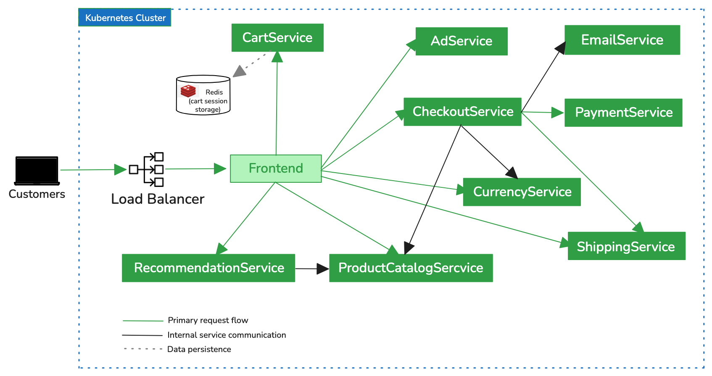

# 🛒 Kubernetes Microservices Deployment with Helm & Helmfile

Production-style deployment of a distributed microservices e-commerce platform on Kubernetes using **Helm charts** and **Helmfile orchestration**.

This project demonstrates **secure service exposure, replica-based availability, protocol-aware health checks, and modular release management**, reflecting real-world **cloud-native deployment practices**.

---

# 📌 Project Overview

This repository deploys a **cloud-native microservices application** to a Kubernetes cluster using modern deployment tooling and best practices.

The project focuses on **production-style deployment patterns**, including:

- Helm for modular application packaging
- Helmfile for declarative multi-chart orchestration
- Kubernetes Deployments & Services
- Replica-based high availability
- Protocol-aware health checks (gRPC, HTTP, TCP)
- Internal service discovery via ClusterIP services

The goal is not just to run containers — but to model **real-world Kubernetes architecture and operational patterns**.

---

# 🧭 Architecture



### Request Flow

```
Customer
   ↓
LoadBalancer Service
   ↓
Frontend Service
   ↓
Internal Microservices
   ↓
Redis (cart session storage)
```

External traffic enters the cluster through a **LoadBalancer service** exposing the Frontend application.

The **Frontend service** acts as the entry point and communicates with backend services responsible for checkout, catalog management, recommendations, payments, shipping, and notifications.

Internal communication between services occurs via **Kubernetes ClusterIP services**, using **gRPC and HTTP protocols** depending on service implementation.

Redis provides **cart session storage**, enabling temporary persistence of user shopping cart data.

---

# 🧰 Technologies Used

- Kubernetes
- Helm
- Helmfile
- Docker
- Redis
- gRPC
- HTTP
- Linux

---

# ⚙️ Deployment Strategy

Each service is deployed as a **Kubernetes Deployment** with production-oriented configuration:

- Multiple replicas for critical services
- Readiness and liveness probes
- Service discovery through Kubernetes DNS
- Label selectors for routing traffic
- Resource requests and limits (applied selectively)

### Service Exposure Model

| Service Type | Purpose |
|---------------|--------|
| **LoadBalancer** | Exposes the Frontend to external users |
| **ClusterIP** | Enables secure internal service-to-service communication |

This architecture ensures backend services remain **private inside the cluster**, reducing attack surface.

---

# 🩺 Health Checks

Health probes are aligned with each service protocol to ensure accurate health monitoring.

| Service Type | Probe Type |
|---------------|-----------|
| Backend services | gRPC health probes |
| Frontend | HTTP readiness & liveness probes |
| Redis | TCP socket probe |

These probes allow Kubernetes to:

- Automatically restart unhealthy containers
- Route traffic only to healthy pods
- Maintain application reliability

---

# 📦 Helm Chart Structure

```
charts/
├── microservice/
│   ├── templates/
│   ├── Chart.yaml
│   └── values.yaml
├── redis/
│   ├── templates/
│   ├── Chart.yaml
│   └── values.yaml
```

- **microservice chart** packages application services
- **redis chart** manages the stateful component

This modular structure enables:

- Reusable deployment templates
- Environment-based configuration
- Simplified application version management

---

# 📜 Deployment Orchestration with Helmfile

Instead of installing charts manually, deployments are managed declaratively using **Helmfile**.

Helmfile manages the deployment of multiple Helm charts declaratively from a single configuration file.

It provides:

- Centralized multi-release management
- Declarative infrastructure state
- Reproducible deployments
- Simplified upgrades and rollbacks

This mirrors **production-style release management for multi-service applications**.

---

# 🚀 Quick Deployment

Prerequisites:

- Kubernetes cluster
- Helm installed
- Helmfile installed

Deploy the full application stack:

```bash
helmfile sync
```

Verify pods are running:

```bash
kubectl get pods
```

Access the application through the **Frontend LoadBalancer service**.

---

# 🛟 High Availability & Fault Tolerance

The application incorporates several reliability mechanisms:

- Core services run with multiple replicas
- Kubernetes automatically replaces failed pods
- Readiness probes prevent traffic to unhealthy containers
- Redis stores cart session data within the cluster

Currently Redis uses:

`emptyDir`

This provides temporary runtime storage.

In production environments this can be upgraded to:

`PersistentVolumeClaim (PVC)`

to enable durable storage across pod restarts.

---

# 🧠 Design Decisions

Several architectural choices were made to reflect **real-world Kubernetes deployment practices**:

- **ClusterIP services** used for internal communication to reduce external exposure
- **LoadBalancer service** used only for the Frontend entry point
- **Helm charts** used for modular packaging of application components
- **Helmfile** used to orchestrate multi-service deployments declaratively
- **Protocol-specific health probes** implemented for accurate service monitoring
- **Replica-based deployments** used to improve availability and resilience
- **Separation of charts** for stateless services and Redis to simplify lifecycle management

These decisions model how distributed applications are typically deployed in **production Kubernetes environments**.

---

# 🏗️ System Design Principles

This architecture reflects several core cloud-native design principles.

### Loose Coupling
Each microservice runs independently and communicates through service endpoints, enabling independent scaling and deployment.

### Fault Isolation
Failures in one service do not directly impact other services due to container isolation and Kubernetes service routing.

### Scalability
Replica-based deployments allow services to scale horizontally as demand increases.

### Observability
Health probes enable Kubernetes to monitor service health and maintain system stability through automatic restarts.

### Infrastructure Abstraction
Helm charts abstract deployment configuration, enabling consistent deployments across environments.

---

# 🎯 What This Project Demonstrates

- Distributed microservices deployment on Kubernetes
- Secure service exposure patterns
- Replica-based service availability
- Protocol-aware health monitoring
- Helm-based modular packaging
- Helmfile-driven orchestration
- Integration of stateless and stateful components

---

# 🚀 Potential Improvements

Future enhancements could include:

- Add **PersistentVolumeClaim (PVC)** for Redis durability
- Implement **Horizontal Pod Autoscaler (HPA)**
- Introduce **Ingress controller with TLS termination**
- Add **Prometheus & Grafana** for observability
- Implement **centralized logging**
- Apply consistent **resource limits and policies across services**

---

# 📁 Repository Structure

```
├── README.md
├── helmfile.yaml
├── charts/
│   ├── microservice/
│   │   ├── templates/
│   │   ├── Chart.yaml
│   │   └── values.yaml
│   └── redis/
│       ├── templates/
│       ├── Chart.yaml
│       └── values.yaml
└── docs/
    └── microservices-architecture.png
```

---

# 💡 Key Takeaway

Running containers is straightforward.

Designing **scalable, resilient, and modular distributed systems** requires careful architectural planning.

This project demonstrates how Kubernetes, Helm, and Helmfile can be combined to manage **complex microservices deployments using production-oriented practices**.

---

# 👤 Author

**Priscilla Salvador**  
Cloud & DevOps Engineer
